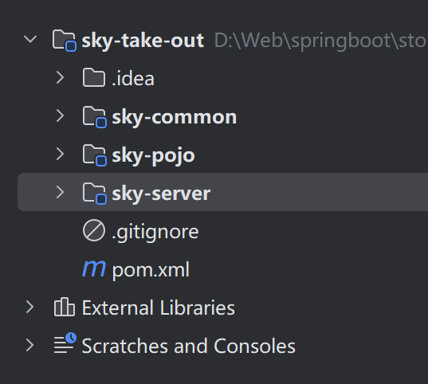

# 苍穹外卖

## 项目结构



​	项目结构：

| 序号 | 名称             | 说明                                                         |
| ---- | ---------------- | ------------------------------------------------------------ |
| 1    | **sky-take-our** | maven.父工程，统一管理依赖版本，聚合其他子模块               |
| 2    | **sky-common**   | 子模块，存放公共类，例如：工具类、常量类、异常类等           |
| 3    | **sky-pojo**     | 子模块，存放实体类、VO、DTO等                                |
| 4    | **aky-server**   | 子模块，后端服务，存放配置文件、Controller、Service、Mapper等 |

​	专用名词介绍：

| 名称   | 说明                                          |
| ------ | --------------------------------------------- |
| Entity | 实体，通常和数据库中的表对应                  |
| DTO    | 数据传输对象，通常用于程序中各层之间传递数据  |
| VO     | 视图对象，为前端展示数据提供的对象            |
| POJO   | 普通java对象，只有属性和对应的gettera和setter |

# 问题

## 问题1 当遇到不能正常显示时间格式

​	解决方法1：

```
@JsonFormat(pattern = "yyyy-MM-dd HH:mm:ss")
```

​	但是这个只能适合1段代码。

​	解决方法2：

```
protected void extendMessageConverters(List<HttpMessageConverter<?>> converters) {
    //创建一下消息转换器对象
    MappingJackson2HttpMessageConverter messageConverter = new MappingJackson2HttpMessageConverter();
    //需要详细转换器设置一下对象转换器，可以将Java对象序列化为Json数据
    messageConverter.setObjectMapper(new JacksonObjectMapper());
    //将上面的消息转换器对象追加到mvc框架的转换器集合中 将自己的消息加入到消息转换器中
    converters.add(0,messageConverter);
}
```

​	扩展 MVC 消息转换器，自定义序列化规则，可以统一对时间格式进行统一，不需要单独编写

